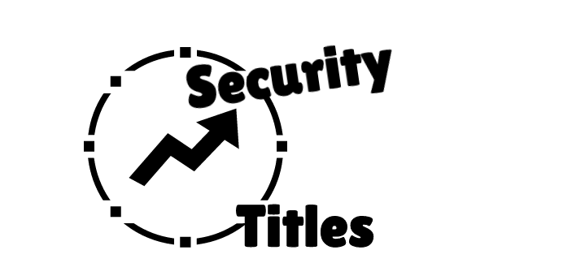

**An open-source effort to standardize security job titles, levels, and expectations across the cybersecurity industry.**

🌐 **Website:** [securitytitles.com](https://securitytitles.com)

---

## 🎯 Purpose

The cybersecurity industry lacks consistent standards for job titles and levels. A "Senior Security Engineer" at one company might be equivalent to a "Security Analyst II" at another, making it difficult to:

- Compare roles across organizations
- Set fair compensation
- Define clear career progression paths
- Write consistent job descriptions
- Benchmark skills and experience

**Security Titles** aims to solve this by providing a comprehensive, open-source framework that standardizes:

- **Job titles and levels** across security disciplines
- **Responsibilities** expected at each level
- **Required and preferred skills**
- **Mentorship expectations** (both giving and receiving)
- **Impact scope and decision authority**
- **Education and certification benchmarks**
- **Salary ranges** across US Government, Startup, and Corporate sectors

---

## 📚 Coverage

### Offensive Security
- **Penetration Testing** — From entry-level testers to Principal engineers
- **Red Team Analysts** — Threat intelligence, social engineering, and campaign planning
- **Red Team Engineers** — Infrastructure, tooling, and technical execution
- **Purple Team** — Bridging offensive and defensive operations
- **Offensive Security Management** — Team leads through Directors

### Defensive Security
- **SOC Analysts** — Security Operations Center professionals
- **Incident Responders** — Incident investigation, containment, eradication, and recovery
- **Security Administrators** — Security control implementation and maintenance
- **Security Engineers** — Building and automating security solutions
- **Security Architects** — Strategic security design and frameworks
- **Insider Threat Analysts** — Behavioral analytics, insider risk detection, and investigation
- **Insider Threat Engineers** — UEBA/DLP platform engineering and behavioral analytics pipelines
- **Defensive Security Management** — Team leads through Directors

### Governance, Risk & Compliance (GRC)
- **Risk Analysts** — Enterprise risk assessment and management
- **Compliance Analysts** — Regulatory compliance and audit management
- **Governance Analysts** — Policy development and security governance
- **GRC Engineers** — GRC platforms and automation
- **Privacy Analysts** — Data protection compliance, PIAs, DSARs, and regulatory adherence
- **Privacy Engineers** — Privacy-by-design implementation, consent management, and data anonymization

### Identity & Access Management (IAM)
- **Identity Governance & Administration** — IGA strategy and implementation
- **Access Management** — SSO, MFA, and authentication systems
- **Privileged Access Management** — PAM solutions and privileged credential management
- **Directory Services** — Active Directory and LDAP administration
- **Customer IAM** — CIAM platforms and customer authentication
- **IAM Architects** — Identity strategy and architecture
- **Identity Security** — Identity Threat Detection and Response (ITDR)

### Specialized Roles
- **AppSec Engineers** — Application security throughout the SDLC
- **AppSec Architects** — Application security strategy and design
- **Cloud Security Engineers** — Cloud infrastructure security and DevSecOps
- **Cloud Security Architects** — Cloud security strategy and architecture
- **EVM Analysts** — Enterprise Vulnerability Management strategy and prioritization
- **EVM Engineers** — Vulnerability scanning platforms and infrastructure
- **Digital Forensics Analysts** — Incident investigation and forensic analysis
- **CTI Analysts** — Cyber Threat Intelligence research and analysis
- **CTI Engineers** — Threat intelligence platforms and automation
- **Fraud Analysts** — Cyber fraud detection, investigation, and prevention
- **Fraud Engineers** — Fraud detection platforms, ML models, and real-time scoring
- **OT Security Engineers** — ICS/SCADA security, industrial protocol protection
- **OT Security Architects** — IT/OT convergence architecture and IEC 62443 compliance
- **Physical Security Engineers** — Converged physical-cyber security systems engineering
- **Physical Security Architects** — Facility security architecture and PSIM design

### Leadership
- **Director** — Security program leadership and strategy
- **Senior Director** — Multi-department security leadership
- **VP/SVP** — Enterprise-wide security strategy
- **CISO** — Chief Information Security Officer

### Security Consulting
- **Security Consultant** — Big 4 consulting career ladder (Analyst through Partner)
- **Virtual CISO (vCISO)** — Firm-employed, multi-client CISO services
- **Fractional CISO** — Independent part-time CISO for 2-5 organizations

---

## 🏗️ Repository Structure

```
securitytitles.com/
├── _data/                    # YAML data files (the core content)
│   ├── offense.yml           # Offensive security role definitions
│   ├── defense.yml           # Defensive security role definitions
│   ├── grc.yml               # Governance, Risk & Compliance roles
│   ├── iam.yml               # Identity & Access Management roles
│   ├── appsec.yml            # Application Security roles
│   ├── cloudsec.yml          # Cloud Security roles
│   ├── evm.yml               # Enterprise Vulnerability Management roles
│   ├── forensics.yml         # Digital Forensics roles
│   ├── cti.yml               # Cyber Threat Intelligence roles
│   ├── insider_threat.yml    # Insider Threat roles
│   ├── fraud.yml             # Cyber Fraud roles
│   ├── privacy.yml           # Privacy roles
│   ├── otsec.yml             # OT Security roles
│   ├── physec.yml            # Physical Security roles
│   ├── leadership.yml        # Security Leadership roles
│   └── consultant.yml        # Security Consulting, vCISO, Fractional CISO
├── _layouts/                 # Jekyll layout templates
│   └── fullwidth.html        # Main page layout with styling
├── index.md                  # Homepage
├── offense.md                # Offensive security page
├── defense.md                # Defensive security page
├── grc.md                    # GRC page
├── iam.md                    # IAM page
├── specialized.md            # Specialized roles page
├── leadership.md             # Leadership page
├── consultant.md             # Security Consulting page
├── salaries.md               # Salary Heatmap page
├── CNAME                     # Custom domain configuration
├── LICENSE                   # BSD 3-Clause License
└── README.md                 # This file
```

### Data Files (`_data/*.yml`)

The core content lives in YAML files under `_data/`. Each role category contains:

```yaml
role_name:
  name: "Display Name"
  description: "Role category description"
  levels:
    - id: "level_id"
      title: "Level Title"
      general_description: "..."
      primary_responsibilities:
        - "Responsibility 1"
        - "Responsibility 2"
      required_skills:
        - "Skill 1"
      preferred_skills:
        - "Skill 1"
      mentorship_requirements: "..."
      impact_scope: "..."
      autonomy_decision_authority: "..."
      communication_stakeholder: "..."
      degree_equivalent: "..."
      certifications:
        - "Cert 1"
      salary:
        us_government: "$X - $Y (GS-X to GS-Y)"
        us_startup: "$X - $Y"
        us_corporate: "$X - $Y"
        us_bigtech: "$X - $Y (Mag7 total comp)"
```

---

## 🚀 Running Locally

This site is built with [Jekyll](https://jekyllrb.com/). To run it locally:

### Prerequisites
- Ruby 2.7+
- Bundler (`gem install bundler`)

### Setup

```bash
# Clone the repository
git clone https://github.com/mubix/securitytitles.com.git
cd securitytitles.com

# Install dependencies
bundle install

# Run the local server
bundle exec jekyll serve

# Visit http://localhost:4000
```

---

## 🤝 Contributing

We welcome contributions from the security community! Here's how you can help:

### Ways to Contribute

1. **Suggest Changes** — Open an issue or start a [discussion](https://github.com/mubix/securitytitles.com/discussions)
2. **Fix Errors** — Submit a PR for typos, outdated information, or inaccuracies
3. **Add Content** — Help flesh out new role categories
4. **Improve Salaries** — Share anonymized compensation data to improve accuracy
5. **Spread the Word** — Share with your network and reference in job postings

### Contribution Guidelines

- **Be specific** — Back up suggestions with real-world experience or data
- **Be inclusive** — Consider different organization sizes, industries, and regions
- **Be constructive** — Focus on improving the framework, not criticizing existing roles
- **Cite sources** — When possible, reference salary surveys, job postings, or industry standards

### Adding a New Role Category

1. Create a new YAML file in `_data/` following the existing structure
2. Update the relevant `.md` page to include the new data
3. Add navigation links in `_layouts/fullwidth.html`
4. Submit a PR with a clear description

---

## 📊 Salary Data Notes

| Sector | Description |
|--------|-------------|
| **US Government** | Based on General Schedule (GS) and Senior Executive Service (SES) pay scales. Varies by locality. |
| **US Startup** | Venture-backed companies. Equity can significantly increase total compensation. |
| **US Corporate** | Fortune 500 and large enterprises. May include 10-30%+ bonus structures. |
| **Big Tech (Mag7)** | Total compensation (base + RSUs + bonus) at Alphabet, Amazon, Apple, Meta, Microsoft, Nvidia, Tesla. Assumes major tech hub. RSUs dominate at senior+ levels. |

**Disclaimer:** Salary figures are estimates based on market data and may vary significantly by geography, company size, industry, and individual negotiation. Use as directional guidance, not absolute benchmarks.

---

## 📜 License

This project is licensed under the **BSD 3-Clause License** — see the [LICENSE](LICENSE) file for details.

```
Copyright (c) 2025, Rob Fuller
All rights reserved.
```

---

## 💬 Community

- **Discussions:** [GitHub Discussions](https://github.com/mubix/securitytitles.com/discussions)
- **Issues:** [GitHub Issues](https://github.com/mubix/securitytitles.com/issues)
- **Website:** [securitytitles.com](https://securitytitles.com)

---

## 🙏 Acknowledgments

This project is maintained by Rob Fuller (mubix), Chris Gates (carnal0wnage) and the security community. Special thanks to all contributors who have helped shape these frameworks.

---

<p align="center">
  <strong>Help us standardize security titles — one role at a time.</strong>
</p>
